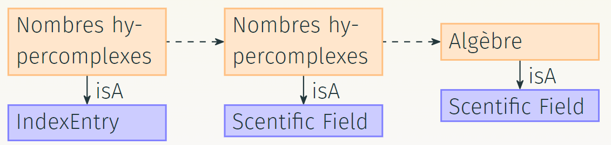
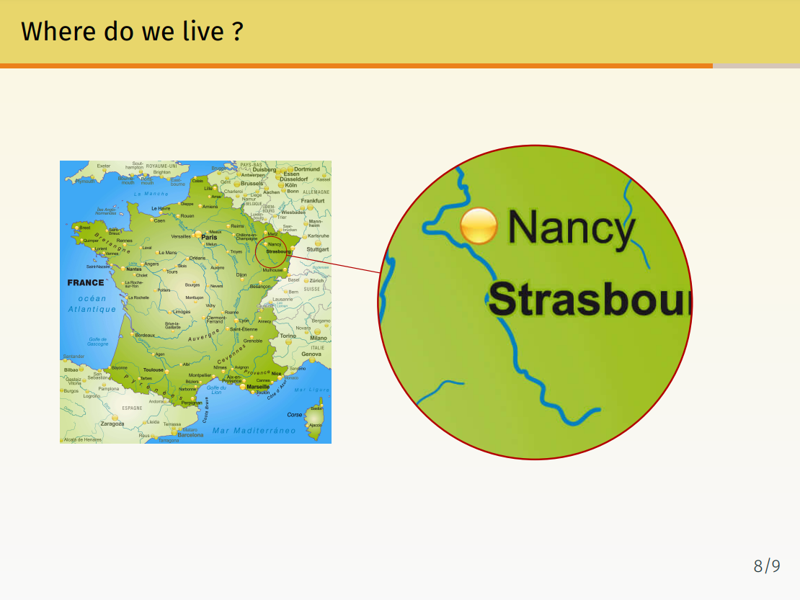

---

## Resume

For my resume, I mainly used the commonly used altacv template to have the LaTeX characteristic style without being too boring. Some sort of compromise between an academic-looking template and something that I could use to make a quick resume for my non-computer scientist friends. To add a even fresher look, I decided to have 6 different colors palettes from which I can choose my theme. I also used the (in)famous Tikz library to add to colored block: one for the header and the other for the right-column in order to imitate some trendy Canvas templates.

!!! warning
    This template is pretty old and not up to my current standard in term of code organisation and cleanliness. A new version with a totally new document class will come soon ! Stay tune for more :octicons-clock-16:

---

## Business card

TeX, as a markup language, and LaTeX by extension, were made to handle the typesetting of documents, their layout and generaly, how they visually look like. But as I dive more and more into document type where I had to manually create the layout (slides with Beamer, resume with Altacv), I decided to challenge myself with a layout-heavy project: create business cards in LaTeX.


This design is inspired by the [business-cards-latex](https://github.com/aorthey/business-cards-latex) repository from Andreas Orthey and the [business-card](https://github.com/opieters/business-card) repository from Olivier Pieters. My template mainly use the Tikz library for the graphic part. The Qrcode library was used to generate a qrcode linking the card to this website. Finally, all icons are from the Fontawesome library.

!!! note
    The Qrcode library allows the creation of a wide variety of qrcodes, including different styles and the possibility to create vCard (Virtual Contact File). This is a interesting library that I would wholehearthly recommand. I think that it's always better to use LaTex to generate a qrcode than to download it from an external website. (After all, LaTeX being Turing complete[^1], we would be fool to not use plainly its potential !)

[^1]:
    If the Overleaf website tell us than the link to the original article was dead, they give a [follow-up article](https://pbelmans.ncag.info/blog/2010/12/12/a-turing-machine-in-latex-follow-u/) by Pieter Belmans (2010). I would recommand this really interesting read. For more Turing complete fun (still furnish by the Overleaf website), one can read : 

    * [This is a Universal Turing Machine (UTM) implemented in Conway's Game of Life](http://rendell-attic.org/gol/utm/index.htm)
    * [The youtube playlist of Turing Machine in Minecraft](https://www.youtube.com/results?search_query=minecraft+turing+machine)

---

## Slides

If I have note create my own class of slides document on LaTeX (yet), I have tried a lot of different thing to be able to create whatever is in my mind as quickly as possible (the goal is: being faster with Beamer than with PowerPoint [^2]). 

[^2]: 
    And by that I mean : being faster than *other people* using PowerPoint, as I will have to (re)learn the software before creating anything, it has been at least a decade since I last touch it.

### My very own Beamer template

To create my Beamer template[^3], I used the Metropolis theme to add a more modern look (I still want to look LaTeX-like without looking old-fashioned). I choosed the option `progressbar=frametitle` to have a progressbar just under the title of each frame, as I think it is easier to feel time passing during a presentation with it than with simply the frames numbering, even with the option `numbering=fraction`. I put the height of this progressbar at 2pt both in the section frames and under every title, as well as the horizontal separation used in the titlepage. 

[^3]:
    *Nota Bene :* I do not plan to make this part a tutorial as it was never my intention even if my formulation can be amiguous on this point. I do not know how hard it would be to make a detailled lesson on how to do a proper template, maybe I will do one in the futur, probably on how to create your own class of document. If you can find the usual (and usually good) documentation on the subject on the internet, I don't have a tutorial that I really liked in mind, contrary to over aspects of coding in LaTeX.

For the color palette, even if I use `seahorse`as a default option, I usually try to create a personalised palette for each of the organisation, I have been a part of, for exemple a magenta palette for the Lille University or something more yellowish for the Lorraine University. I also had a vertical shading to a light gray as as background in order to be gentle on our eyes as the frames are all on light theme.

I also modified the table of content, firstly by making the font bigger as it was way to small for comfort, especially for the people in the last row of a big room. Then I choosed to number my table of content with circle and to hide all subsections. Finally, I often choose to put my code for a proper table of content in a new command in order to be able to quickly change it without changing the body of my text. Maybe I am influenced by the HTML/CSS separation but I like to have the style configuration in one file and my content in another.

```latex
\documentclass{beamer}

%%%%%%%%%%%%%%%%%%%%%%%%%%%%%%%%%%%%%%%%%%%%%%%%%%%%%%%% Metropolis theme
\usetheme[numbering=fraction, progressbar=frametitle]{metropolis}
\usecolortheme{seahorse}
\setbeamercolor*{palette primary}{use=structure,fg=black,bg=yellow}
\setbeamertemplate{background canvas}[vertical shading][bottom=lightgray!10,top=arylideyellow!20]

%%%%%%%%%%%%%%%%%%%%%%%%%%%%%%%%%%%%%%%%%%%%%%%%%%%%%%%% Progression bar
\makeatletter
\setlength{\metropolis@titleseparator@linewidth}{2pt}
\setlength{\metropolis@progressonsectionpage@linewidth}{2pt}
\setlength{\metropolis@progressinheadfoot@linewidth}{2pt}
\makeatother

%%%%%%%%%%%%%%%%%%%%%%%%%%%%%%%%%%%%%%%%%%%%%%%%%%%%%%%% Table of content
\setbeamerfont{section in toc}{size=\Large}
\newcommand{\maketoc}{
    \label{toc}
    \setbeamertemplate{section in toc}[circle]
    \tableofcontents[hideallsubsections]

```

I also took the time to modify the different title use through my slides. First my titlepage, where I usually put a little bit more information than on a traditionnal beamer. Following different request from my friends, I also put a copyright allowing this template to be used. The following titlepage will be used for the presentation of our master thesis :

```latex
%%%%%%%%%%%%%%%%%%%%%%%%%%%%%%%%%%%%%%%%%%%%%%%%%%%%%%%% Title page

\setbeamertemplate{title page}{
    \begin{minipage}[c][\paperheight]{\textwidth}
        \ifx\inserttitlegraphic\@empty\else\usebeamertemplate*{title graphic}\fi
        \vfill
        \ifx\inserttitle\@empty\else\usebeamertemplate*{title}\fi
        \ifx\insertsubtitle\@empty\else\usebeamertemplate*{subtitle}\fi
        \usebeamertemplate*{title separator}
        \begin{minipage}[t]{.5\textwidth}
            \ifx\beamer@shortauthor\@empty\else\usebeamertemplate*{author}\fi
            \vspace*{0.5em}
            \ifx\insertdate\@empty\else\usebeamertemplate*{date}\fi
            \ifx\insertinstitute\@empty\else\usebeamertemplate*{institute}\fi
        \end{minipage}
        \begin{minipage}[t]{.5\textwidth}
            \vspace*{2em}
            {\hspace{3.2em}\small Supervisor: \textit{supervisor} \par}
            \vspace*{0.2em}
            {\hspace{3.2em}\small Company: \textit{company}}
        \end{minipage}
        \vfill
        \hspace{9.7cm}\scalebox{.4}{Beamer model by Prunelle DT}
    \end{minipage}
}
```

A titlepage usually come with its titlegraphic containing the different institutional logos one must display. Here the first `\logo`is more of a decorative picture that will be reuse later. For my master thesis, I used a picture of Henri Poincaré as I worked on [his correspondance](projects/internship.md).

```latex
%%%%%%%%%%%%%%%%%%%%%%%%%%%%%%%%%%%%%%%%%%%%%%%%%%%%%%%% Titlegraphic
\titlegraphic{ 
    {\hspace{8.2cm}\includegraphics[height=3cm]{\logo}}
    
    \vspace{3.6cm}
    
    {
        \includegraphics[width=2.5cm]{\logoFaculty}
        \hspace{0.5cm}
        \includegraphics[width=2cm]{\logoUniversity}
        \hspace{2.2cm}
        \includegraphics[width=3cm]{\logoCompany}
    }
}
```

I also used the `\logo`variable for my section and subsection page as I choose to display it right in the middle. To allow a better slides naviguation, I hide a button inside this image, clicking on the pretty face of Poincaré will bring the user back to the table of content (or anywhere with a `\label{}`).

```latex
%%%%%%%%%%%%%%%%%%%%%%%%%%%%%%%%%%%%%%%%%%%%%%%%%%%%%%%% Section page
\AtBeginSection{
  \frame[plain,noframenumbering]{
    \sectionpage
    \center\hyperlink{toc}{\includegraphics[height=4cm]{\logo}}
}}

%%%%%%%%%%%%%%%%%%%%%%%%%%%%%%%%%%%%%%%%%%%%%%%%%%%%%%%% Subsection page
\AtBeginSubsection{
  \frame[plain,noframenumbering]{
    \subsectionpage
    \center\hyperlink{toc}{\includegraphics[height=4cm]{\logo}}
  }}
```

Finally, as I wanted to modify my appendix frame, I cheated a little bit and modified my new part page to contain a table of content. Because I often use my appendices to hide secret frames used to answer any trick questions, I wanted to start the section numerotation from 0. Sadly, in a beamer, `\setcounter{section}{0}`is not enough, so I added `\beamer@tocsectionnumber=0\relax`and it did the trick !

```latex
%%%%%%%%%%%%%%%%%%%%%%%%%%%%%%%%%%%%%%%%%%%%%%%%%%%%%%%% Part page (appendice)
\setbeamertemplate{part page}{
        \begin{beamercolorbox}[sep=8pt,center,wd=\textwidth]{part title}
            \usebeamerfont{part title}\insertpart\par
        \end{beamercolorbox}
}

\makeatletter
\AtBeginPart{%
  \beamer@tocsectionnumber=0\relax
  \setcounter{section}{0}
  \frame[plain,noframenumbering]{
    \partpage
    \setbeamertemplate{section in toc}[circle]
    \tableofcontents[hideallsubsections]
  }
}
\makeatother
```

### Tikz library

#### Knowledge graphs

As I like to work on subject related to the semantic web, a really important thing for me was to be able to show some exemple of knowledge graphs/ontologies. I thought about generating outside of LaTeX but I like transparant background for my graph and removing it on the image of a graph rarely give satisfactory results. So, as I was stucked with LaTeX, I decided to have some fun with the Tikz library. My first step was to define some style for my arrow (in both directions with `pre`and `post`) and my different nodes : `individual`, `literal` and `concept`. To do so, a few library are used : `arrows.meta` for the arrows and `shapes.geometric` for the geometric shape.

```latex
\tikzstyle{individual}=[rectangle,draw=orange!50,fill=orange!20,thick]
\tikzstyle{concept}=[rectangle,draw=blue!50,fill=blue!20,thick]
\tikzstyle{litteral}=[rectangle,text=red]
\tikzstyle{pre}=[<-,>={Stealth[round]},semithick]
\tikzstyle{post}=[->,>={Stealth[round]},semithick]
```

With this code, we obtain some thick arrows, individuals in an orange rectangle, concepts in a blue rectangle and litteral as a red text in an invisible rectangle. It can give somethin like this :



This graph was generated with the following code :

```latex
\begin{tikzpicture}
[bend angle=25,text width=2.5cm]

\node[individual] (entry) {Nombres hypercomplexes};
\node[concept] (index) [below=0.5cm of entry] {IndexEntry} edge[pre] node[auto,swap] {isA} (entry);

\node[individual] (nb) [right=1cm of entry] {Nombres hypercomplexes} edge[pre,dashed] node[auto,swap] {} (entry);
\node[concept] (sf) [below=0.5cm of nb] {Scentific Field} edge[pre] node[auto,swap] {isA} (nb);

\node[individual] (al) [right=1cm of nb] {Algèbre} edge[pre,dashed] node[auto,swap] {} (nb);
\node[concept] (sf2) [below=0.5cm of al] {Scentific Field} edge[pre] node[auto,swap] {isA} (al);

\end{tikzpicture}
```

#### The magnifying glass

An other important use of the Tikz library in my slides are the magnifying glass. The idea is simple: you have a quite large image and you want to zoom in without loosing the big picture. To do so, I used the `spy` Tikz library.C



This library is pretty simple to use with the following code :

```latex
\begin{tikzpicture}[
    spy using outlines={
      circle,
      magnification=10,
      size=5cm,
      connect spies}]
    \node[inner sep=0pt] {\pgfimage[width=0.4\textwidth]{img/map.jpg}};
    \spy[red!70!black] on (1.2,0.8) in node at (.5\textwidth,0);
\end{tikzpicture}
```

The first part of the code precise how we want our magnifying glass to look like, for example here : a 5cm circle, who magnify 10 times the map and with a line connecting the two circles. The second part create a node with an image (using directly the PGF library). Finally, we create the magnifying glass on the coordinates 1.2, 0.8 (0, 0) being the center of the image. This code is a little bit more technical than before as we use the PGF library, an hidden library hidden under the TiKz library.

### Some overlays fun

### A different zoom on frame

### Even more movement : gif embedding

### A pretty and colorful box

### Sharing code and other environments

!!! note
    To know more, don't hesitate to read the following documentations :[Beamer](https://texlive.mycozy.space/macros/latex/contrib/beamer/doc/beameruserguide.pdf), [Metropolis](https://mirror.ibcp.fr/pub/CTAN/macros/latex/contrib/beamer-contrib/themes/metropolis/doc/metropolistheme.pdf), [PGF/Tikz](https://ctan.gutenberg-asso.fr/graphics/pgf/base/doc/pgfmanual.pdf) with the [website for the tutorials](https://tikz.dev/) and a [list of tikz library](https://tikz.dev/libraries) (hours of uninterrupted fun for the brave ones), [Animate](https://texlive.mycozy.space/macros/latex/contrib/animate/animate.pdf) and [Mdframed](https://ctan.tetaneutral.net/macros/latex/contrib/mdframed/mdframed.pdf)