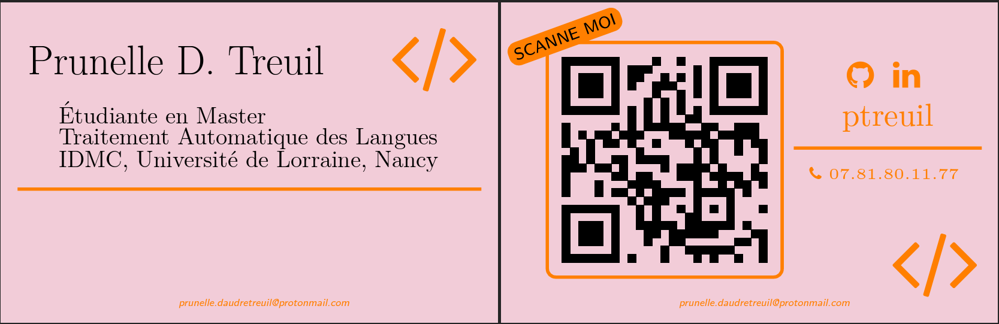

---

## Resume

For my resume, I mainly used the commonly used altacv template to have the LaTeX characteristic style without being too boring. Some sort of compromise between an academic-looking template and something that I could use to make a quick resume for my non-computer scientist friends. To add a even fresher look, I decided to have 6 different colors palettes from which I can choose my theme. I also used the (in)famous Tikz library to add to colored block: one for the header and the other for the right-column in order to imitate some trendy Canvas templates.

!!! warning
    This template is pretty old and not up to my current standard in term of code organisation and cleanliness. A new version with a totally new document class will come soon ! Stay tune for more :octicons-clock-16:

---

## Business card

TeX, as a markup language, and LaTeX by extension, were made to handle the typesetting of documents, their layout and generaly, how they visually look like. But as I dive more and more into document type where I had to manually create the layout (slides with Beamer, resume with Altacv), I decided to challenge myself with a layout-heavy project: create business cards in LaTeX.

This design is inspired by the [business-cards-latex](https://github.com/aorthey/business-cards-latex) repository from Andreas Orthey and the [business-card](https://github.com/opieters/business-card) repository from Olivier Pieters. My template mainly use the Tikz library for the graphic part. The Qrcode library was used to generate a qrcode linking the card to this website. Finally, all icons are from the Fontawesome library.

!!! note
    The Qrcode library allows the creation of a wide variety of qrcodes, including different styles and the possibility to create vCard (Virtual Contact File). This is a interesting library that I would wholehearthly recommand. I think that it's always better to use LaTex to generate a qrcode than to download it from an external website. (After all, LaTeX being Turing complete[^1], we would be fool to not use plainly its potential !)

[^1]:
    If the Overleaf website tell us than the link to the original article was dead, they give a [follow-up article](https://pbelmans.ncag.info/blog/2010/12/12/a-turing-machine-in-latex-follow-u/) by Pieter Belmans (2010). I would recommand this really interesting read. For more Turing complete fun (still furnish by the Overleaf website), one can read : 

    * [This is a Universal Turing Machine (UTM) implemented in Conway's Game of Life](http://rendell-attic.org/gol/utm/index.htm)
    * [The youtube playlist of Turing Machine in Minecraft](https://www.youtube.com/results?search_query=minecraft+turing+machine)