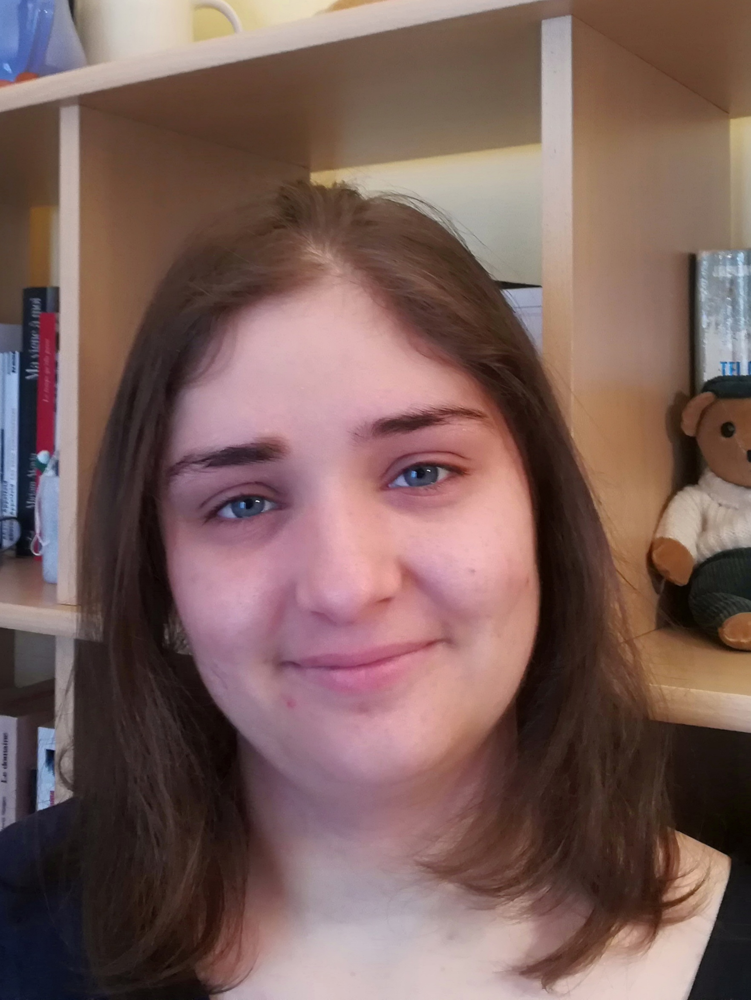

----

My name is Prunelle and I don't know what I want. No, that's not totally right, I know way to well what I want, I just don't want to choose only one thing to want. Never been capable of such a feat. I always wanted it all: literature, computer science, linguistic, artificial intelligence, all the most human of sciences and the hardest of them all. As such, no one should be surprise of the multidisciplinary nature of my studies and the diversity of the project I have tackle.

----

## Formations :

* **Msc NLP**: *Natural Language Processing*, 2022-2024, IDMC, Université de Lorraine

* **MIASHS Bachelor**: *Mathematics and Computer Science applied to Humanities, Cognitive Science speciality*, 2019-2022, Université de Lille

## Work expreriences

* **End-of-study internship**: Spring 2024, LORIA, Vandoeuvre-lès-Nancy 
  
(See Projects: Internship for more)

* **Internship**: Spring 2021, SCALAB, Tourcoing

* **Civic Service** 2018-2019, Unis-Cité, Belfort

Two missions: animation of movies projection with debate for all ages, and initiation lectures to computer sciences for children (6-10 years)

----

## Contact

- **Mail personnel:** [prunelle.daudretreuil@protonmail.com](mailto:prunelle.daudretreuil@protonmail.com)
- **Mail université:**[prunelle.daudre-treuil4@etu.univ-lorraine.fr](mailto:prunelle.daudre-treuil4@etu.univ-lorraine.fr)
- **GitHub:** [ptreuil](https://github.com/ptreuil)
- **LinkedIN:** [ptreuil](https://www.linkedin.com/in/ptreuil/)

